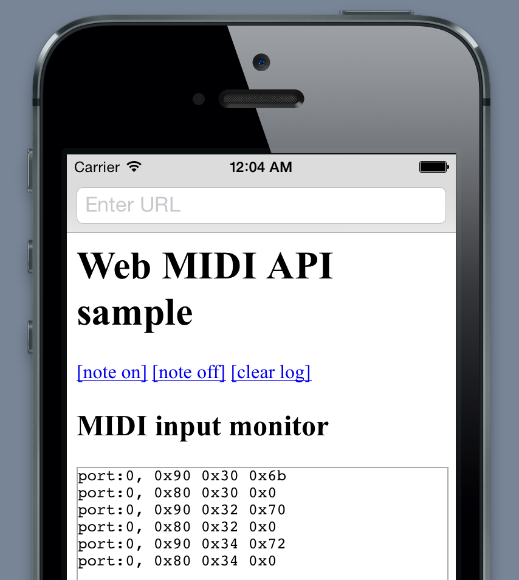

WebMIDIAPIShimForiOS
====================
This is a shim to enable [Web MIDI API](https://dvcs.w3.org/hg/audio/raw-file/tip/midi/specification.html) on iOS. WebMIDIAPIPolyfill.js is the bridge script to invoke iOS native Core MIDI APIs. And WebViewDelegate.m is the receptor for informal URL schemes triggered by the bridge script. You can build a hybrid Web MIDI application with using them.

When launching the project, a simple web browser will show. It uses JavaScript injection hack by using the UIWebView's method `-(NSString *)stringByEvaluatingJavaScriptFromString:(NSString *)script`. You can run Web MIDI applications using the browser as if iOS WebKit had a native API support.

Known issues
--------------------
* The native bridge script will be deactivate when moving pages by clicking links. I don't know how to inject JS codes to UIWebView permanently.
* Timestamp parameters are not supported so far. It'll be supported in future release.

Related projects
--------------------
The idea was brought from [WebMIDIAPIShim](https://github.com/cwilso/WebMIDIAPIShim) by Chris Wilson. WebMIDIAPIPolyfill.js in this project was derived from his great work.

License
--------------------
Apache License 2.0
